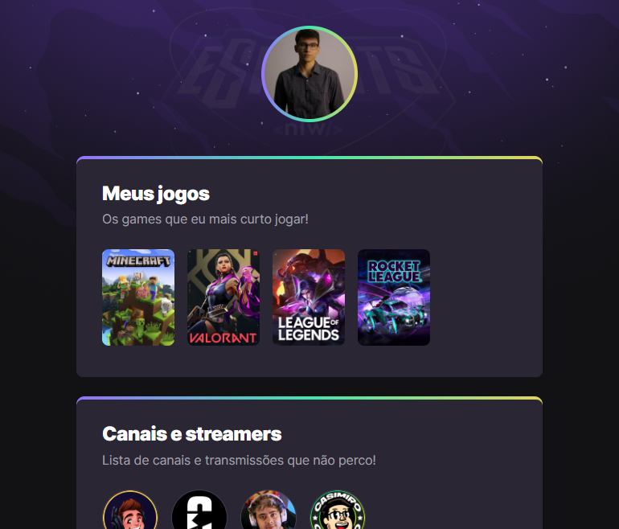

# NLW eSports

> Trilha Explorer

Projeto construído na 9º edição do evento Next Level Week da Rocketseat.

🔗 [Clique aqui para acessar](https://pedrohenriquecoppola.github.io/nlw-esports-explorer/)

Meu primeiro projeto, iniciado e concluído com o objetivo de conhecer e aprender sobre os fundamentos da programação e das linguagens utilizadas. 💻💙

## ⚙️ Tecnologias
- HTML
- CSS
- Git e Github

## 🔗 Links

